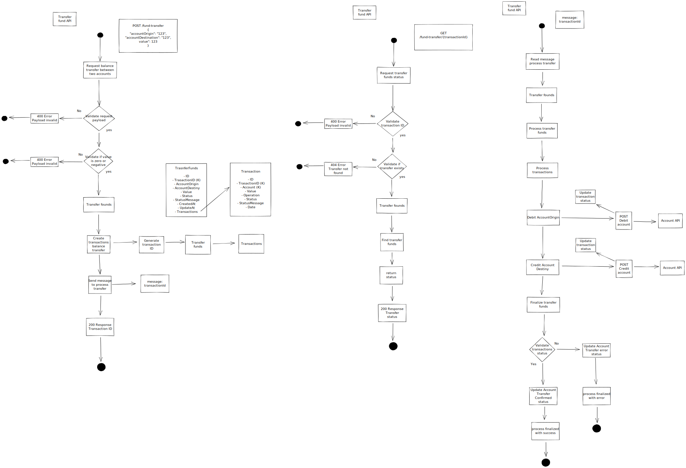

# transfer-fund-api
API to transfer balance from a account to another

[](https://nodejs.org "Go to Node.js homepage")
[](https://typescriptlang.org "Go to TypeScript homepage")
[](https://www.mongodb.com/ "Go to MongoDB homepage")
[](https://www.rabbitmq.com/ "Go to RabbitMQ homepage")
[](https://www.docker.com/ "Go to Docker homepage")


[](https://github.com/davidRosini/transfer-fund-api/blob/main/Dockerfile)
[](https://github.com/davidRosini/transfer-fund-api/blob/main/docker-compose.yml)
[](https://github.com/davidRosini/transfer-fund-api/tree/main/postman)

### Packages
[](https://www.npmjs.com/package/express)
[](https://www.npmjs.com/package/mongoose)
[](https://www.npmjs.com/package/amqplib)
[](https://www.npmjs.com/package/axios)

## Table of Contents

  - [Setup](#setup)
  - [Run application](#run-application)
  - [Docker image](#docker-image)
  - [API flow chart](#api-flow-chart)
 
## Setup

Run docker-compose command in the terminal to start the local dependencies (require [docker](https://docs.docker.com/get-docker/) instaled)
```
$ docker-compose up -d
```

Install node dependencies with (require [nodejs](https://nodejs.org/en/download/) installed)
```
$ npm install
```

## Run application

Run server with command
```
$ npm run start
```

if need to debug the application use command
```
$ npm run debug
```

## Docker image

Setup .env file with the path to the applications dependencies

Build the image
```
$ docker build . -t <your name>/transfer-fund-api
```

Run the application
```
$ docker run -p 3000:3000 -d <your name>/transfer-fund-api
```

## API flow chart

<div align="center">
    
</div>
